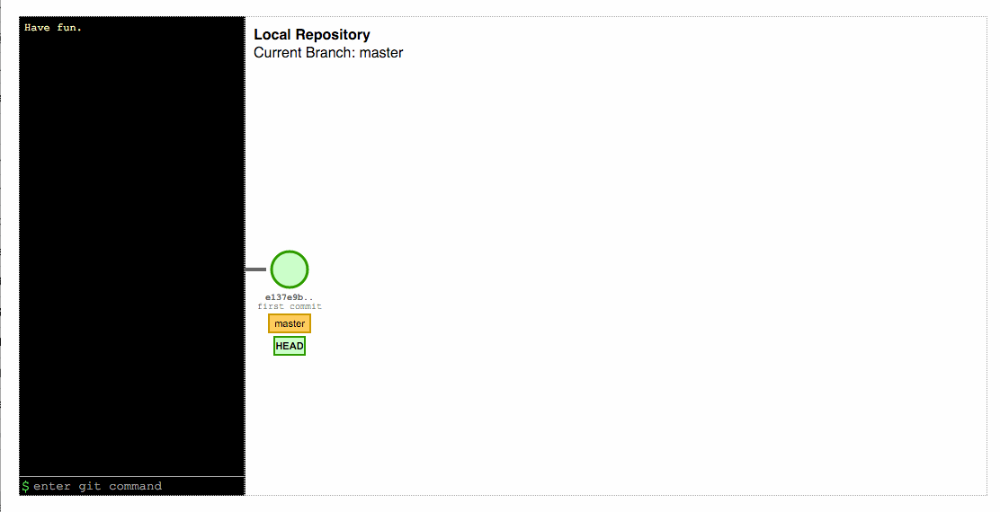

Visualize Git
=============

Git is an amazingly powerful tool — and it can be amazingly confusing. Demystify Git commands with visualizations powered by D3. Give it a try at [http://git-school.github.io/visualizing-git/](http://git-school.github.io/visualizing-git/)!

[Visualize Git](http://git-school.github.io/visualizing-git/) illustrates what's going on underneath the hood when you use common Git operations. You'll see what exactly is happening to your commit graph. We aim to support all the most basic git operations, including interacting with remotes.

Here are some examples of the fun things you can do with it:

## Rebase

## Cherry-pick

## Push/pull

We hope you find this tool useful! Issues and pull requests are welcome! Enjoy! :sparkles:

Based on the awesome work done by [@onlywei](https://github.com/onlywei/explain-git-with-d3) :bow:
