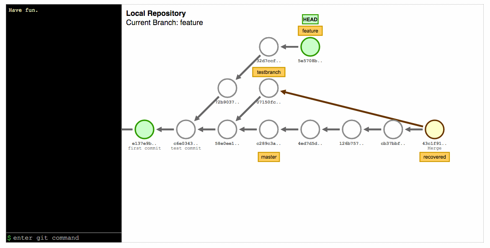
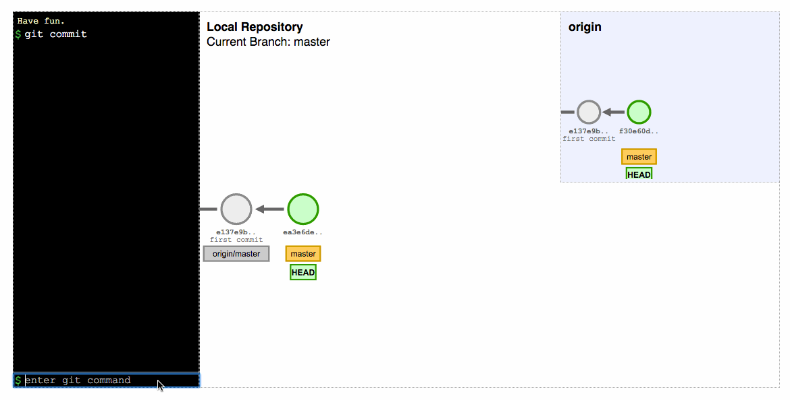

Visualize Git
=============

Git is an amazingly powerful tool — and it can be amazingly confusing. Demystify Git commands with visualizations powered by D3. Give it a try at [https://git-school.ggbest.ru](https://git-school.ggbest.ru)!

[Visualize Git](https://git-school.ggbest.ru) illustrates what's going on underneath the hood when you use common Git operations. You'll see what exactly is happening to your commit graph. We aim to support all the most basic git operations, including interacting with remotes.


## Changes in this fork
Some improvements for testing. Import/Export buttons for Load & Save current state from/to json files. HASH's of commits changed to Cn (C0, C1, C2 and etc.).


Here are some examples of the fun things you can do with it:

## Rebase


## Cherry-pick


## Push/pull


## Supported operations

Type `help` in the command box to see a list of supported operations

`pres()` = Turn on presenter mode<br>
`undo` = Undo the last git command<br>
`redo` = Redo the last undone git command<br>
`mode` = Change mode (`local` or `remote`)<br>
`clear` = Clear the history pane and reset the visualization

Available Git Commands:
```
git branch
git checkout
git cherry_pick
git commit
git fetch
git log
git merge
git pull
git push
git rebase
git reflog
git reset
git rev_parse
git revert
git tag
```


We hope you find this tool useful! Issues and pull requests are welcome! Enjoy! :sparkles:
Based on this repo: [https://github.com/git-school/visualizing-git](https://github.com/git-school/visualizing-git) and also
based on the awesome work done by [@onlywei](https://github.com/onlywei/explain-git-with-d3) :bow:
